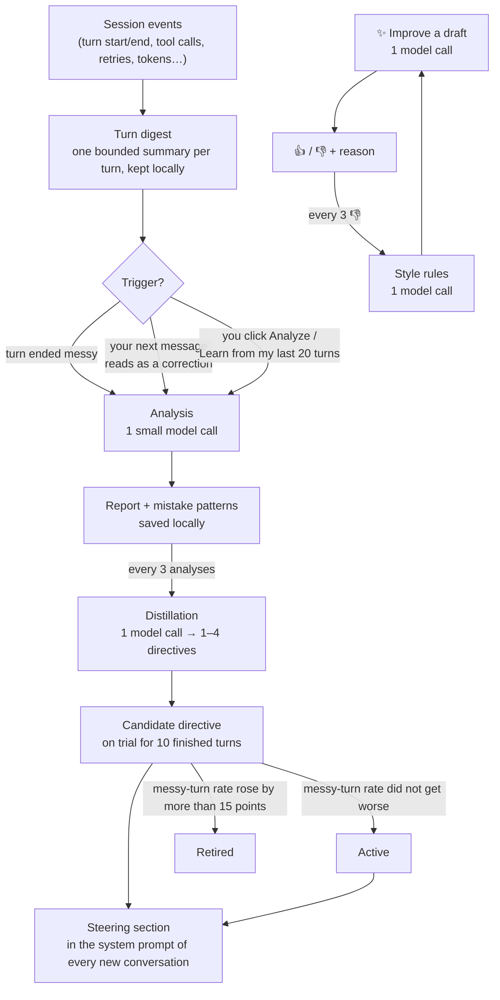

# How it works

*For anyone who wants to understand what Tacit does between "you send a prompt" and
"the agent behaves differently next time". Every number here comes from the code.*

## The pipeline



The left column is the zero-click loop. The ✨ Improve branch on the right is
manual and feeds a separate, smaller memory (style rules).

## 1. Turn digest

Tacit listens to the harness's session events and folds them into one small
record per turn — the **digest**. It contains the prompt (first 4000 characters),
the number of model steps, up to 50 tool calls (name + first 500 characters of the
arguments), counts of tool errors / retries / compactions, token usage, the final
answer (first 4000 characters), how the turn ended, and the model/provider used.
Tool *results* are never kept, only whether they errored. The newest 60 turns per
conversation are retained. All of this is derived from events the harness already
stores; Tacit adds no polling.

## 2. What counts as "messy"

A finished turn is messy when any of these is true:

| Signal | Triggers auto-analysis | Counts in the trend and in directive trials |
| --- | --- | --- |
| at least one retry | yes | yes |
| at least one tool error | yes | yes |
| at least one context compaction | yes | yes |
| the turn was cancelled or rejected | yes | yes |
| 15 or more model steps (`autoMinSteps`) | yes | **no** — long-but-successful work is never held against a directive |

## 3. Triggers

| Trigger | Condition | What is analyzed |
| --- | --- | --- |
| **auto** | the newest turn finished messy, ended after Tacit started, and its prompt is not a bare continuation | that turn |
| **correction** | you send a new message that is ≤ 300 characters and starts with or contains a correction marker — *no, wrong, I meant, I said, undo, revert, still, again, instead, why did you, that's not, doesn't work, 不对, 不是, 错了, 我是说, 为什么*… | the **previous** turn, with your message attached as evidence |
| **manual** | you click *Analyze* in the Tacit tab | that turn (bare continuations return "continuation" without a call) |
| **bootstrap** | you click *Learn from my last 20 turns* | up to 20 recent turns, serially, then one forced distillation |

*Bare continuation* means the whole prompt is something like "continue", "go
ahead", "ok", "yes", "继续", "好的" — up to six words starting with one of those.

Auto and correction analyses are counted against the daily cap
(`autoDailyBudget`, 30 by default, local calendar day). Manual and bootstrap are
not.

## 4. Analysis

One model call (`deepseek-v4-flash` by default, low reasoning effort, answer
forced through a tool schema). It receives:

| Part | Size |
| --- | --- |
| the previous finished turn's prompt and answer, as context the agent already had | ≤ 600 + 600 chars |
| the original prompt | as retained (≤ 4000 chars) |
| the digest counters: steps, tool calls, errors, retries, compactions, tokens, model | — |
| the first 25 tool calls, name + arguments | ≤ 400 chars each |
| the final answer | ≤ 3000 chars |
| your next message, for correction-triggered analyses | ≤ 1000 chars |

It is told explicitly that a short prompt is adequate when the previous turn
supplies the context, and that heavy-but-successful work is not a prompt fault.

It returns a **report**: a list of problems (`kind`, `severity`, what, why), an
improved prompt, and a short explanation. The report is saved locally; the
problem kinds are aggregated into the **mistake patterns** of your profile (top
12 by count). If the answer is not valid JSON, Tacit re-asks once with a repair
prompt — that is the only retry.

## 5. Distillation → directives

After every 3 new analyses (`directiveEvery`) one more call reads your top
patterns, the last few corrections ("prompt" → "your correction"), your style
rules and the current directives, and returns the complete new set of **1–4
directives**: one imperative sentence each, ≤ 220 characters, written for the
*agent* ("The user often omits which app they mean — check `apps/web` first.").

Rules applied to the result:

- directives that would make the agent *ask you* instead of compensating are dropped;
- a directive you typed yourself is kept untouched and listed first;
- a re-emitted directive keeps its identity (state, trial, on/off);
- a genuinely new one becomes a **candidate**;
- at most 8 directives in total.

## 6. Trials

| State | How you get there | Injected into new conversations? | Shown as |
| --- | --- | --- | --- |
| **candidate** | freshly distilled | yes | *trial n/10* (n counts finished turns in conversations that were steered by it) |
| **active** | 10 finished turns later (`directiveTrialTurns`), messy-turn rate ≤ baseline + 0.15 (`directiveWorseBy`); or you typed it; or you re-enabled a retired one | yes | *active* |
| **retired** | messy-turn rate during the trial rose by more than 15 percentage points over the baseline | no | *retired · messy turns 20% → 40% while active* |
| **off** | you untick it | no | greyed out |

The baseline is the messy-turn rate over the latest 20 finished turns at the
moment the candidate was created. Trials are a *trend check*, not an A/B test:
a candidate is judged on every finished turn of every conversation whose frozen
steering text contained it, with no control group. Conversations that started
before the candidate existed (or before Tacit was restarted) never contained it
and count toward nothing.

## 7. Steering section

Active and candidate directives are rendered as a system-prompt section named
`tacit:steering` (order 60 — after the persona, before tool guidance):

```
## About this user (learned by Tacit from their past prompts)
Compensate silently when the answer is discoverable; ask only when it is not.
Explicit instructions in the prompt always win over these notes.
- The user often omits which app they mean — check apps/web first.
- …
```

The whole section is capped at 1400 characters (about 300 tokens). It is
**frozen per conversation**: the first time a conversation assembles its system
prompt the text is captured and reused for the rest of that conversation, so the
model's prefix cache stays warm. Any change — a verdict, a toggle, an edit —
applies to conversations started afterwards. `steerAgent: false` turns the
section into an empty string.

## 8. Optional: context before each send (`enrichPrompts`, off by default)

When enabled, on the first step of every turn whose draft is 8–1500 characters,
one small call reads your directives, top patterns and the last two turns, and
returns a note. The note is **appended** as a separate, plugin-sourced message
("Context from Tacit (learned from this user's past prompts, not their words): …").
Your own message is never rewritten. The note is shown in the Tacit tab under
*Context added before the send*. This call runs on every qualifying send and is
not covered by the daily cap.

## 9. ✨ Improve, feedback and style rules

*Improve* sends your draft, the last two turns, your style rules, the last three
👎 reasons and your trusted patterns to the model and returns a rewrite with a
rationale. *Apply* replaces the draft and marks those patterns as applied.

- 👍 counts as accepted. 👎 asks for a one-line reason, counts as rejected, and
  after every 3 reasons one call distills them into **style rules** (up to 6,
  oldest replaced) that ride every later Improve call.
- Free verification: when the next turn finishes, Tacit compares its outcome
  (errors, retries, compactions, cancel, empty answer) with the turn before the
  rewrite and marks the patterns as verified or not.
- Trust score per pattern: `((accepted + 2·verified) − (rejected + unverified)) / (applied + 1)`.
  Patterns applied twice or more are only offered again while their score is positive.

## 10. The measured trend

**Settings → Tacit** shows the messy-turn rate and tokens per turn for the first
20 finished turns versus the latest 20, across all loaded conversations (only
turns still within the retained window). The chips appear once 40 finished turns
exist. Steps are not counted as messy here (see §2).

## Glossary

| Term | Meaning |
| --- | --- |
| **turn** | one user message and everything the agent did until it answered |
| **digest** | Tacit's bounded summary of a turn (§1) |
| **messy turn** | a turn with retries, tool errors, compactions, a cancel/reject, or — for auto-analysis only — 15+ steps |
| **correction** | a short follow-up message that tells the agent it got it wrong |
| **continuation** | a bare "continue / ok / yes" — never analyzed |
| **report** | the result of one analysis: problems, improved prompt, explanation |
| **pattern** | a recurring problem kind aggregated across reports, with trust counters |
| **directive** | one sentence the agent follows on your behalf; *candidate → active / retired* |
| **trial** | the 10-turn probation of a candidate directive |
| **steering section** | the system-prompt block that carries the directives |
| **style rule** | a rewrite preference distilled from your 👎 reasons; used only by ✨ Improve |
| **enrichment** | the opt-in note appended before a send (§8) |
| **bootstrap** | the one-click analysis of your recent history |

---

← [Getting started](getting-started.md) · Next: [Privacy, cost & limitations](privacy-and-cost.md)
